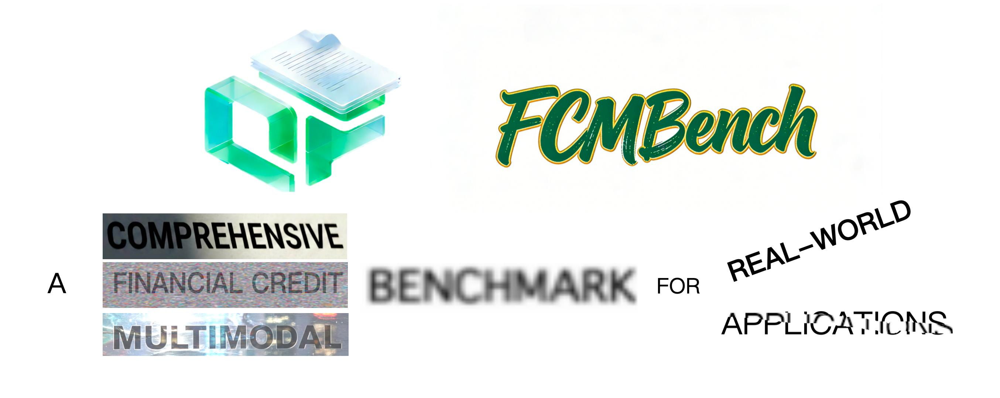

**FCMBench** is a multimodal benchmark for credit-risk–oriented workflows. It aims to provide a standard playground to promote collaborative development between academia and industry and provides standardized datasets, prompts, and evaluation scripts across multiple tracks (image, video, speech, agents, etc.)

## 🔥 News 
- 【**2026. 01. 01**】✨ We are proud to launch [**FCMBench-V1.0**](https://github.com/QFIN-tech/FCMBench/tree/main/vision_language), which covers 18 core certificate types, including 4,043 privacy-compliant images and 8,446 QA samples. It involves 3 types of Perception tasks and 4 types of Reasoning tasks, which are cross-referenced with 10 categories of robustness inferences. All the tasks and inferences are derived from real-world critical scenarios.

> **Status:** Public release (v1.0).  
> **Maintainers:** [奇富科技 / Qfin Holdings](https://github.com/QFIN-tech)  
> **Contact:** [yangyehui-jk@qifu.com]

---

## Tracks Overview

### 1) Vision-Language Track (✅ Available, **FCMBench-V1.0**)

Image-based financial document understanding: 

- **Entry:** [Vision-Language Track](vision_language)
- **Inputs:** document images + text prompts (JSONL, one sample per line)
- **Outputs:** text responses (JSONL, one sample per line)
- **Evaluation:** [Evaluation Script](vision_language/evaluation.py)

#### Paper & Project Links
- [**Paper (arXiv)**](https://arxiv.org/abs/2601.00150)
- [**Paper (PDF)**](https://arxiv.org/pdf/2601.00150)
- [**Project Page**](https://github.com/QFIN-tech/FCMBench/tree/main/vision_language)
- [**Leaderboard**](vision_language/LEADERBOARD.md)
- [**Dataset (ModelScope)**](https://modelscope.cn/datasets/QFIN/FCMBench-V1.0)
- [**Dataset (Hugging Face)**](https://huggingface.co/datasets/QFIN/FCMBench-V1.0)


### 2) Video Understanding Track (🕒 Coming Soon)

### 3) Speech Understanding & Generation Track (🕒 Coming Soon)

### 4) Multi-step / Agentic Track (🕒 Coming Soon)

## Citation
```
@misc{yang2026fcmbenchcomprehensivefinancialcredit,
      title={FCMBench: A Comprehensive Financial Credit Multimodal Benchmark for Real-world Applications}, 
      author={Yehui Yang and Dalu Yang and Wenshuo Zhou and Fangxin Shang and Yifan Liu and Jie Ren and Haojun Fei and Qing Yang and Tao Chen},
      year={2026},
      eprint={2601.00150},
      archivePrefix={arXiv},
      primaryClass={cs.CV},
      url={https://arxiv.org/abs/2601.00150}, 
}
```
