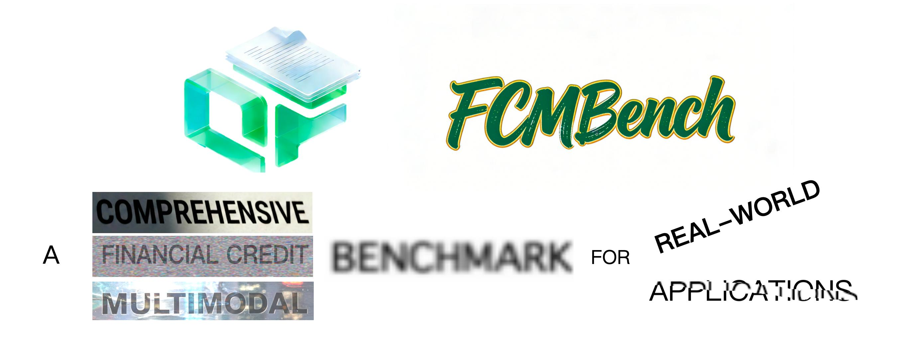

**FCMBench** is a multimodal benchmark for credit-risk–oriented workflows. It aims to provide a standard playground to promote collaborative development between academia and industry and provides standardized datasets, prompts, and evaluation scripts across multiple tracks (image, video, speech, agents, etc.)

<p align="center">
🤗 <a href="https://huggingface.co/datasets/QFIN/FCMBench-Data"><b>Hugging Face</b></a>&nbsp;&nbsp; | &nbsp;&nbsp;🤖 <a href="https://modelscope.cn/datasets/QFIN/FCMBench-Data"><b>ModelScope</b></a>&nbsp;&nbsp; | &nbsp;&nbsp;📑 <a href="https://arxiv.org/abs/2601.00150"><b>FCMBench Paper</b></a>&nbsp;&nbsp; | &nbsp;&nbsp;📑 <a href="https://arxiv.org/abs/2604.25186"><b>FCMBench-Video Paper</b></a>&nbsp;&nbsp; | &nbsp;&nbsp;🏆 <a href="https://qfin-tech.github.io/FCMBench"><b>Leaderboard</b></a>&nbsp;&nbsp; | &nbsp;&nbsp;🌐 <a href="./README_cn.md"><b>简体中文</b></a>
</p>

## 🔥 News
- 【**2026. 04. 29**】🎬 We released **FCMBench-Video**, a benchmark for document-video intelligence. Built from 495 captured atomic videos and composed into 1,200 long-form videos with 11,322 QA instances across 28 document types (bilingual CN/EN). Paper: [arXiv 2604.25186](https://arxiv.org/abs/2604.25186).
- 【**2026. 03. 16**】✨ We released **FCMBench-V1.1**. This version adds English document images and corresponding QA pairs, expands the covered document types to 26, and increases the dataset to 5,198 images and 13,806 QA samples.
- 【**2026. 01. 01**】We are proud to launch **FCMBench-V1.0**, which covers 18 core certificate types, including 4,043 privacy-compliant images and 8,446 QA samples. It involves 3 types of Perception tasks and 4 types of Reasoning tasks, which are cross-referenced with 10 categories of robustness inferences. All the tasks and inferences are derived from real-world critical scenarios.

> **Status:** Public release (v1.1).<br>
> **Maintainers:** [奇富科技 / Qfin Holdings](https://github.com/QFIN-tech)<br>
> **Contact:** [yangyehuisw@126.com]

---

## Tracks Overview

| Entry | Inputs | Outputs | Evaluation Script | Leaderboard | Paper | Sample Data |
|---|---|---|---|---|---|---|
| [Vision-Language Track](vision_language) | document images + text prompts (JSONL, one sample per line) | text responses (JSONL, one sample per line) | [evaluation.py](vision_language/evaluation.py) | [Leaderboard](https://qfin-tech.github.io/FCMBench) | [arXiv 2601.00150](https://arxiv.org/abs/2601.00150) | [Examples](https://qfin-tech.github.io/FCMBench/Examples.html) |
| [Video Understanding Track](video_understanding) | document videos + text prompts (JSONL) | text responses (JSONL) | [benchmark_eval.py](video_understanding/benchmark_eval.py) | via [submission](video_understanding/README.md#leaderboard) | [arXiv 2604.25186](https://arxiv.org/abs/2604.25186) | see [README](video_understanding/README.md) |

---

### 1) Vision-Language Track (✅ Available)

Image-based financial document understanding.

#### Sample Data
Preview sample images and QA examples on the [Examples page](https://qfin-tech.github.io/FCMBench/Examples.html).

#### Reference Model Demo
We also provide access to an interactive demo of our Qfin-VL-Instruct model, which achieves strong performance on FCMBench.
If you are interested in trying the Gradio demo, please contact [yangyehuisw@126.com] with the following information:
- Name
- Affiliation / Organization
- Intended use (e.g., research exploration, benchmarking reference)
- Contact email

Access will be granted on a case-by-case basis.

---

### 2) Video Understanding Track (🎬 Available)

Document-video intelligence benchmark covering document perception, temporal grounding, and evidence-grounded reasoning under realistic handheld capture conditions. Built from 495 captured atomic videos composed into 1,200 long-form videos (20s/40s/60s duration tiers) with 11,322 expert-annotated QA instances across 28 document types in bilingual Chinese/English settings. See the [paper](https://arxiv.org/abs/2604.25186) for full benchmark details and evaluation results on nine Video-MLLMs.

#### Sample Data
Please refer to the [Video Understanding track README](video_understanding/README.md) for the full data composition, instruction file descriptions, and quickstart guide. A stratified 10% subset with ground-truth (`FCMBench-Video_v1.0_small.jsonl`) is available for self-evaluation.

#### Reference Model Demo
*(TBD)*

---

### 3) Speech Understanding & Generation Track (🕒 Coming Soon)

### 4) Multi-step / Agentic Track (🕒 Coming Soon)

## Citation

**FCMBench (Vision-Language Track):**
```
@misc{yang2026fcmbenchlargescalefinancialcredit,
      title={FCMBench: The First Large-scale Financial Credit Multimodal Benchmark for Real-world Applications}, 
      author={Yehui Yang and Dalu Yang and Fangxin Shang and Wenshuo Zhou and Jie Ren and Yifan Liu and Haojun Fei and Qing Yang and Yanwu Xu and Tao Chen},
      year={2026},
      eprint={2601.00150},
      archivePrefix={arXiv},
      primaryClass={cs.CV},
      url={https://arxiv.org/abs/2601.00150},
}
```

**FCMBench-Video (Video Understanding Track):**
```
@misc{cui2026fcmbenchvideobenchmarkingdocumentvideo,
      title={FCMBench-Video: Benchmarking Document Video Intelligence}, 
      author={Runze Cui and Fangxin Shang and Yehui Yang and Qing Yang and Tao Chen},
      year={2026},
      eprint={2604.25186},
      archivePrefix={arXiv},
      primaryClass={cs.CV},
      url={https://arxiv.org/abs/2604.25186}, 
}
```

## Star History

[](https://www.star-history.com/#QFIN-tech/FCMBench&type=date&legend=top-left)
