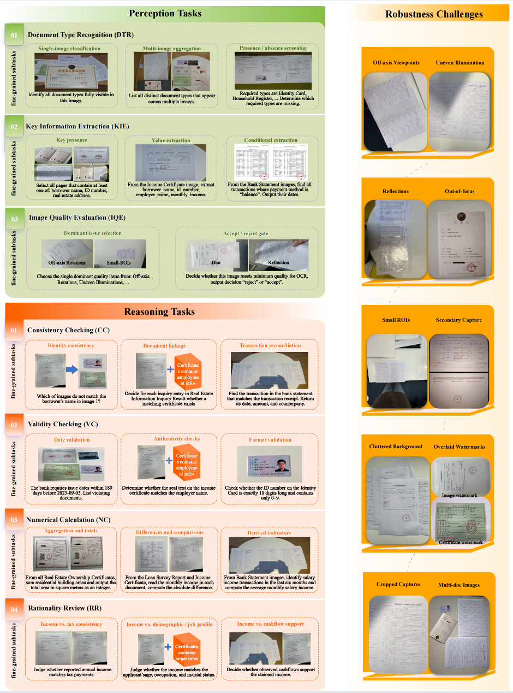

# FCMBench — Vision Language Track Evaluation



This repository provides evaluation scripts for **FCMBench** (Vision-Language track).  
The workflow is:

1) download the image data  
2) run inference with your model to produce a JSONL prediction file  
3) evaluate predictions against the test groundtruth 

---

## Environments

- Python 3.10+
- [`uv`](https://docs.astral.sh/uv/) for environment management (recommended)

---

## Quickstart

### 1) Download image data and uncompress

The image data are hosted on both [**ModelScope**](https://modelscope.cn/datasets/QFIN/FCMBench-V1.0) and [**Hugging Face**](https://huggingface.co/datasets/QFIN/FCMBench-V1.0).

```bash
unzip V1.0_TESTSET.zip # uncompress to ./data/oceanus-share/V1.0_IMAGES_TEST/
```

### 2) Run inference and save results (JSONL)

Use any inference framework or API to generate predictions, and save them as a **JSONL** file (one JSON object per line).

- Example API request code: `example_api_request.py`
- Example prediction(output) file format: `example_prediction.jsonl`

> Tip: Keep the prediction file in UTF-8 and ensure each line is valid JSON.

### 3) Evaluate predictions

From the repository root:

For `uv` users:
  
```bash
cd vision_language # this folder
uv sync
uv run evaluation.py prediction_results.jsonl FCMBench_v1.0_testset.jsonl
```

For `pip` users:

```bash
cd vision_language # this folder
pip3 install openai>=2.14.0 pandas>=2.3.3
python3 evaluation.py prediction_results.jsonl FCMBench_v1.0_testset.jsonl
```

Where: 
- ```prediction_results.jsonl``` is your model output file 
- ```example_prediction.jsonl``` is the example of expected model output file
- ```FCMBench_v1.0_testset.jsonl``` is the official test annotation file

## Output

The evaluator prints summary metrics to stdout.
