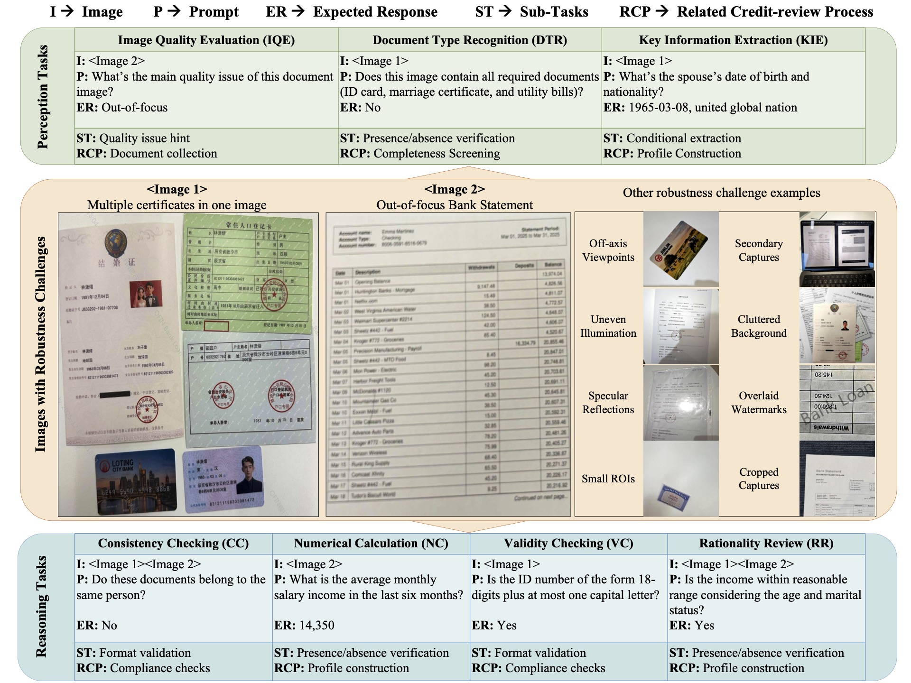

# FCMBench — 视觉语言赛道评测

[🌐 English](README.md)



本仓库提供 **FCMBench**（视觉语言赛道）的评测脚本。
整体流程为：

1) 下载图片数据
2) 使用你的模型进行推理，生成 JSONL 预测文件
3) 依据测试集真值进行评测（当可用时）

---

## 环境要求

- Python 3.10+
- 推荐使用 [`uv`](https://docs.astral.sh/uv/) 进行环境管理

---

## 快速开始

### 1) 下载并解压图片数据

图片数据同时托管在 [**ModelScope**](https://modelscope.cn/datasets/QFIN/FCMBench-Data) 和 [**Hugging Face**](https://huggingface.co/datasets/QFIN/FCMBench-Data)。

```bash
unzip FCMBench_v1.1_Images.zip
```

### 2) 运行推理并保存结果（JSONL）

使用任意推理框架或 API 生成预测结果，并将其保存为 **JSONL** 文件（每行一个 JSON 对象）。

- API 请求示例代码：`example_api_request.py`
- 预测结果（输出）文件格式示例：`prediction_results_example.jsonl`

> 提示：请确保预测文件为 UTF-8 编码，且每行为合法的 JSON。

### 3) 评估预测结果

FCMBench 提供两个测试标注文件：
- `FCMBench_v1.1_testset_small.jsonl`：提供真值标注的子集，用于自测、调试和诊断。
- `FCMBench_v1.1_testset_full.jsonl`：全量测试集，仅提供提示词（不含真值），用于生成排行榜提交结果。

注意：子集（`*_small.jsonl`）的排名通常较全量测试集更保守，即模型间的相对排序通常是稳定的，但绝对指标值可能与全量测试集存在差异。

从仓库根目录执行：

使用 `uv`：

```bash
cd vision_language  # 进入本文件夹
uv sync
uv run evaluation.py prediction_results.jsonl FCMBench_v1.0_testset_small.jsonl
```

使用 `pip`：

```bash
cd vision_language  # 进入本文件夹
pip3 install openai>=2.14.0 pandas>=2.3.3
python3 evaluation.py prediction_results.jsonl FCMBench_v1.0_testset_small.jsonl
```

参数说明：
- `prediction_results.jsonl` 为你的模型输出文件；如尚未生成，可使用 `prediction_results_example.jsonl`
- `FCMBench_v1.1_testset_small.jsonl` 为官方自测子集标注文件（含真值）

---

## 排行榜提交

如需加入 FCMBench 排行榜：

1. 对 `FCMBench_v1.1_testset_full.jsonl` 进行推理
2. 将预测结果保存为 JSONL 文件（格式与示例文件一致）
3. 将 JSONL 文件发送至 [yangyehuisw@126.com]，并附上以下信息：
   - 模型名称 / 版本
   - 推理框架（或 API）及关键参数设置（如 temperature、max tokens 等）
   - 是否使用了特殊的后处理（如适用）

我们验证通过后，会在隐藏的真值文件上计算官方指标并更新排行榜。

---

## 输出

评测器会在终端打印汇总指标。
